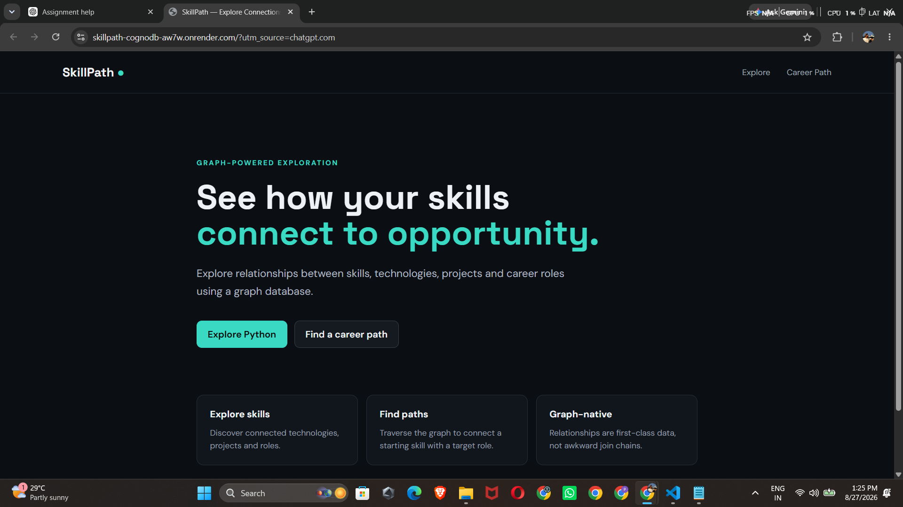
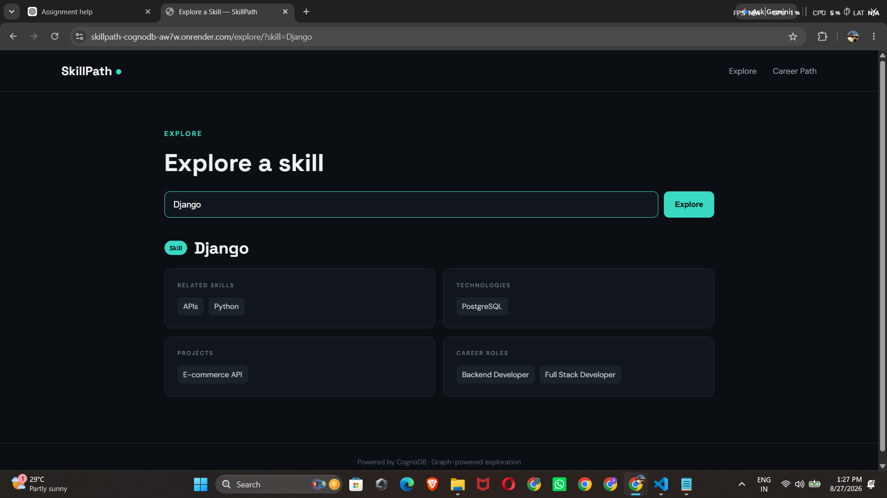

# SkillPath — Graph-Powered Career Explorer

SkillPath is a web application backed by **CognoDB**, a managed openCypher graph database. It helps users explore how skills connect to technologies, projects, and career roles.

## Why a graph database?

The useful questions in SkillPath are about **connections** rather than isolated records.

For example:

- Which roles require a particular skill?
- Which projects use that skill?
- Which technologies are used by those projects?
- What skills can lead toward a target career role?
- What is the shortest connection between a starting skill and a target role?

A relational design would require several join tables and increasingly complex multi-table joins for these traversals. A graph model represents these connections directly as relationships and makes multi-hop traversal natural.

The career-path query is especially graph-native because it searches for a shortest path across multiple relationship types rather than relying on a fixed sequence of relational joins.

## Data Model

```text
(:Skill)-[:RELATED_TO]->(:Skill)
(:Role)-[:REQUIRES]->(:Skill)
(:Project)-[:USES]->(:Skill)
(:Project)-[:USES]->(:Technology)
```

The graph represents skills, technologies, projects, and career roles as nodes connected through meaningful relationships.

## Main Graph Queries

### 1. Skill Exploration

The skill exploration query combines multiple graph relationships around a selected skill and returns:

- Related skills
- Technologies
- Projects
- Career roles

### 2. Multi-hop Career Path

The career-path query finds a shortest path from a starting skill to a target career role.

This demonstrates graph traversal across multiple relationship types rather than using a fixed sequence of relational joins.

All application queries are parameterized through the official Neo4j Python driver.

## Tech Stack

- Python
- Django
- Official Neo4j Python Driver
- CognoDB / openCypher
- HTML
- CSS

## Features

- Explore skills and their graph relationships
- Discover related technologies
- Find projects using a skill
- Discover career roles connected to a skill
- Find a connected career path from a skill to a target role
- User-friendly database error handling
- Deployed using Render

## Running Locally

### 1. Create the CognoDB Instance

Create a free CognoDB instance and keep the generated password private.

### 2. Create a Virtual Environment

Windows:

```bash
python -m venv .venv
.venv\Scripts\activate
pip install -r requirements.txt
```

### 3. Configure Environment Variables

Create a `.env` file:

```text
COGNODB_URI=your-cognodb-uri
COGNODB_USERNAME=cognodb
COGNODB_PASSWORD=your-password
SECRET_KEY=your-secret-key
DEBUG=True
```

Never commit real credentials to GitHub.

### 4. Seed the Database

PowerShell:

```powershell
$env:COGNODB_URI="your-uri"
$env:COGNODB_USERNAME="cognodb"
$env:COGNODB_PASSWORD="your-password"

python scripts/seed_database.py
```

### 5. Start Django

```bash
python manage.py runserver
```

Open:

```text
http://127.0.0.1:8000/
```

## Error Handling

If CognoDB is unreachable or credentials are missing, the application displays a user-friendly database error instead of exposing connection details or a Python traceback.

## Screenshots


### Home Page



### Skill Exploration



### Career Path


### Home Page

The home page provides access to Skill Exploration and Career Path features.

### Skill Exploration

Example: searching for `Django` displays related skills, technologies, projects, and career roles.

### Career Path

Example: searching from `Python` to `Data Engineer` returns the connected graph path.

## Live Demo

https://skillpath-cognodb-aw7w.onrender.com/

## Submission

**GitHub Repository:**  
https://github.com/SatishPratipati/skillpath-cognodb

**Live Demo:**  
https://skillpath-cognodb-aw7w.onrender.com/